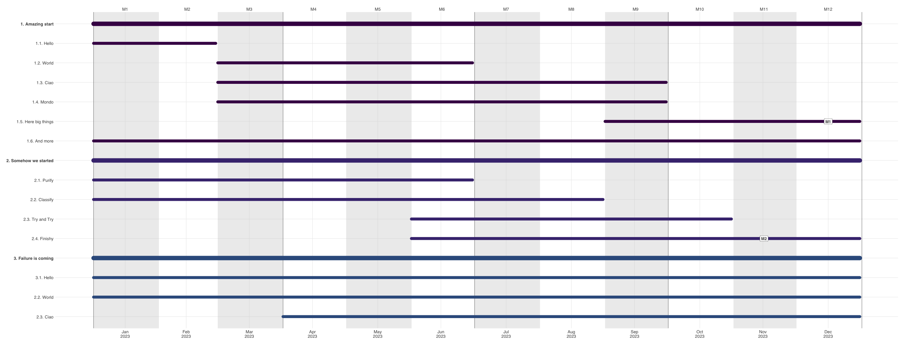

# Gannt charts from Excel tables

Using R/Python to plot Gannt charts starting from Excel tables
(to make it easier for collaborators to feed us data).

Uses [ganttrify](https://github.com/giocomai/ganttrify), an R
library by Giorgio Comai, and [Google charts](https://developers.google.com/chart/interactive/docs/gallery/ganttchart),
a Javascript library for interactive plots.

* Stand-alone [R script for PDF/PNG output](r-plot)
* Stand-alone [Python script for HTML output](html-plot)
* Integrated package **coming soon**

Example R plot:

Example HTML plot: [online demo](https://jsfiddle.net/3khzytoL/)

### See also

* [R Gannt charts](https://jtr13.github.io/cc19/gantt-charts.html)
* [R/Plotly Gannt charts](https://plotly.com/r/gantt/)
