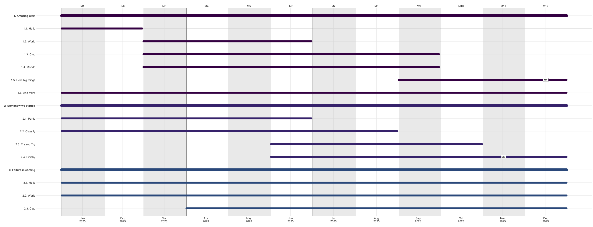

# R Gannt Chart with ganttrify

### Input

The script takes the Excel sheet with two worksheets:

1) Gannt

wp | activity | start | end | site | depends
---|----------|-------|-----|------|----------
Task|Subtask1 | 1     | 8   | A    | NA

2) Milestones

activity| spot_type | spot_date
--------|-----------|-----------
Subtask1| M1        | 7

:bulb: start and end are month number, where 1 is the first
month of the project (see `--start-date`).

### Output

The script produces a PDF and a PNG output:

* [PDF example](gannt.pdf)
* [PNG image](gannt.png)



### Usage

1. Install [ganttrify](https://github.com/giocomai/ganttrify)
```R
# install.packages("remotes")
remotes::install_github("giocomai/ganttrify")
```
2. Use the `gannt.R` script.
